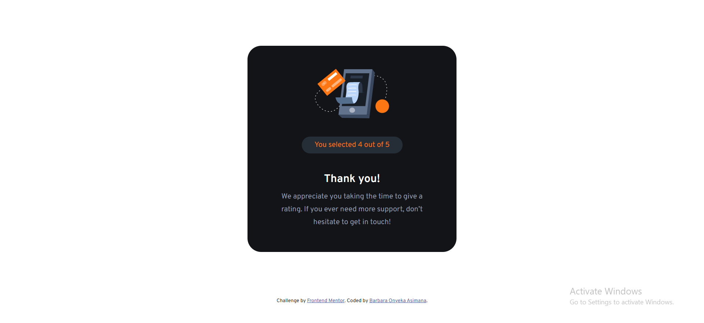

<!-- @format -->

# Frontend Mentor - Interactive rating component solution

This is a solution to the [Interactive rating component challenge on Frontend Mentor](https://www.frontendmentor.io/challenges/interactive-rating-component-koxpeBUmI). Frontend Mentor challenges help you improve your coding skills by building realistic projects.

## Table of contents

- [Overview](#overview)
  - [The challenge](#the-challenge)
  - [Screenshot](#screenshot)
  - [Links](#links)
- [My process](#my-process)
  - [Built with](#built-with)
  - [What I learned](#what-i-learned)
  - [Continued development](#continued-development)
  - [Useful resources](#useful-resources)
- [Author](#author)

## Overview

### The challenge

Users should be able to:

- View the optimal layout for the app depending on their device's screen size
- See hover states for all interactive elements on the page
- Select and submit a number rating
- See the "Thank you" card state after submitting a rating

### Screenshot


---


---


---



### Links

- Solution URL: [Interactive Rating Component](https://www.frontendmentor.io/solutions/responsive-interactive-rating-component-with-css-and-js-v3Az-UMTeU)
- Live Site URL: [Live site URL](https://barbara131.github.io/web-development/interactive-rating-component-main/index.html)

## My process

### Built with

- Semantic HTML5 markup
- CSS custom properties
- Flexbox
- Mobile-first workflow

### What I learned

While taking up this challenge, I learned how to store data within my localstorage so that I would be able to retrieve the stored data and display the data in the thank-you.html page.

Code snippets, see below:

```js

function rateClick() {
  var selectedRate = this.innerHTML;
  // console.log(rateNum);

  localStorage.setItem('rate', selectedRate);

}

```

### Continued development

- I would want to get comfortable with the use of JS (especially areas touching functions, methods, etc) by practicing, as it is fundamental langauage.

### Useful resources

- [Resource 1](https://www.w3schools.com/)
- [Resource 2](https://developer.mozilla.org/en-US/)

## Author

- Behance - [asimana Barbara](https://www.behance.net/barbaraasimana)
- Frontend Mentor - [@Barbara131](https://www.frontendmentor.io/profile/Barbara131)
- Twitter - [@asimana_barbara](https://x.com/asimana_barbara?t=GnfokJobp2fos4gJwct7eg&s=08)
