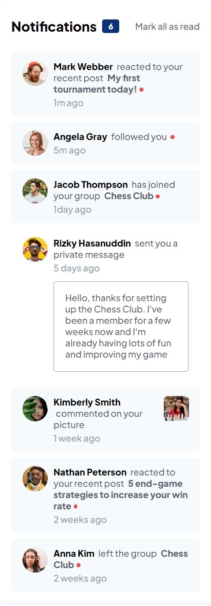
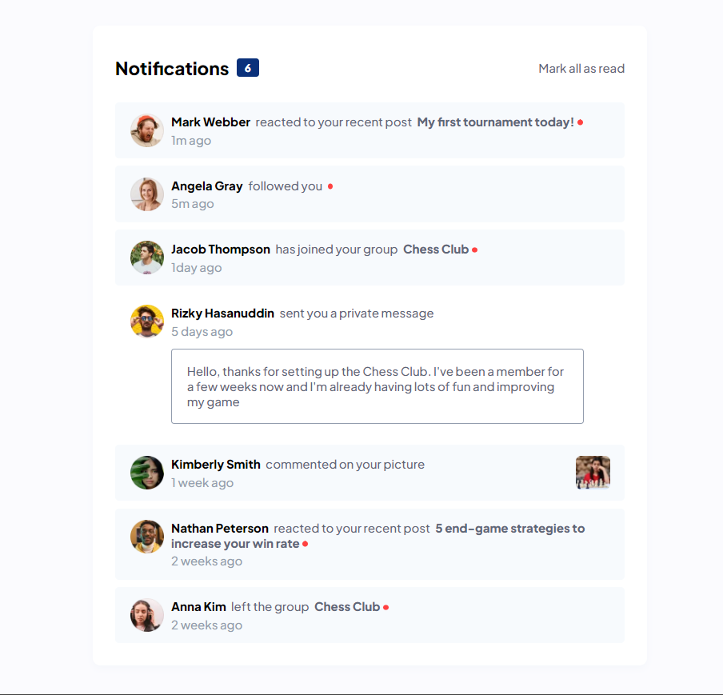

<!-- @format -->

# Frontend Mentor - Notifications page solution

This is a solution to the [Notifications page challenge on Frontend Mentor](https://www.frontendmentor.io/challenges/notifications-page-DqK5QAmKbC). Frontend Mentor challenges help you improve your coding skills by building realistic projects.

## Table of contents

- [Overview](#overview)
  - [The challenge](#the-challenge)
  - [Screenshot](#screenshot)
  - [Links](#links)
- [My process](#my-process)
  - [Built with](#built-with)
  - [What I learned](#what-i-learned)
  - [Continued development](#continued-development)
  - [Useful resources](#useful-resources)
- [Author](#author)

**Note: Delete this note and update the table of contents based on what sections you keep.**

## Overview

### The challenge

Users should be able to:

- Distinguish between "unread" and "read" notifications
- Select "Mark all as read" to toggle the visual state of the unread notifications and set the number of unread messages to zero
- View the optimal layout for the interface depending on their device's screen size
- See hover and focus states for all interactive elements on the page

### Screenshot

Mobile Screenshot


---

Desktop Screenshot


### Links

- Solution URL: [Add solution URL here](https://your-solution-url.com)
- Live Site URL: [Add live site URL here](https://barbara131.github.io/web-development/notifications-page-main/index.html)

## My process

### Built with

- Semantic HTML5 markup
- CSS custom properties
- Flexbox
- Mobile-first workflow
- [jQuery](https://jquery.com/) - JS library

### What I learned

I learned how to make use of jQuery in this project and the new things I learned are on jQuery methods, and they are seen below;

```js
$('.col').not(exclude).addClass('read');

message.find(innerImg).hide();
```

### Continued development

I'll still further in the below to gain mastery
-jQuery
-JS
-React.js

### Useful resources

- [Resource 1](https://www.w3schools.com/)

- [Resource 2](https://stackoverflow.com/)

- [Resource 3](https://chat.openai.com/)

## Author

- Behance - [asimana Barbara](https://www.behance.net/barbaraasimana)
- Frontend Mentor - [@Barbara131](https://www.frontendmentor.io/profile/Barbara131)
- Twitter - [@asimana_barbara](https://x.com/asimana_barbara?t=GnfokJobp2fos4gJwct7eg&s=08)
