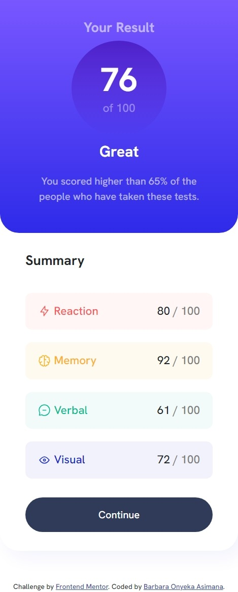

<!-- @format -->

# Frontend Mentor - Results summary component solution

This is a solution to the [Results summary component challenge on Frontend Mentor](https://www.frontendmentor.io/challenges/results-summary-component-CE_K6s0maV). Frontend Mentor challenges help you improve your coding skills by building realistic projects.

## Table of contents

- [Overview](#overview)
  - [The challenge](#the-challenge)
  - [Screenshot](#screenshot)
  - [Links](#links)
- [My process](#my-process)
  - [Built with](#built-with)
  - [What I learned](#what-i-learned)
  - [Continued development](#continued-development)
  - [Useful resources](#useful-resources)
- [Author](#author)

## Overview

### The challenge

Users should be able to:

- View the optimal layout for the interface depending on their device's screen size
- See hover and focus states for all interactive elements on the page
- **Bonus**: Use the local JSON data to dynamically populate the content

### Screenshot

Mobile Screenshot - 

---

Desktop Screenshot - 

### Links

- Solution URL: 
- Live Site URL: 

## My process

### Built with

- Semantic HTML5 markup
- CSS custom properties
- Flexbox
- Mobile-first workflow

### What I learned

While I carrying put this project, I learnt how to add gradient to a background which can be seen below.

Use this section to recap over some of your major learnings while working through this project. Writing these out and providing code samples of areas you want to highlight is a great way to reinforce your own knowledge.

As seen below:

```css
.first {
  background: linear-gradient(hsl(252, 100%, 67%), hsl(241, 81%, 54%));
}
```

### Continued development

-I would like to keep practicing on CSS and also add Javascript too so that i can take on improve as well as take on challenging projects which will help me grow.

### Useful resources

- [Resource 1](https://www.w3schools.com/) - This is a helpful resource especially when I needed help in adding a gradients as well as some CSS things. I recommend this resource as it helps in both HTML, CSS, and other things related to web development.

- [Resource 2](https://developer.mozilla.org/en-US/) - This is an amazing resource that helped in checking how to remove an outline from a button tag, etc. I recommend this resource as it helps in both HTML, CSS, and other things related to web development.

- [Resource 3](https://stackoverflow.com/) - This is an exceptional tool that helped in debugging why the codes i wrote in CSS concerning @media for responsiveness wasn't working. It is an exceptional tool that helps you get help when you encounter an issue.

## Author

- Behance - [asimana Barbara](https://www.behance.net/barbaraasimana)
- Frontend Mentor - [@Barbara131](https://www.frontendmentor.io/profile/Barbara131)
- Twitter - [@asimana_barbara](https://x.com/asimana_barbara?t=GnfokJobp2fos4gJwct7eg&s=08)
