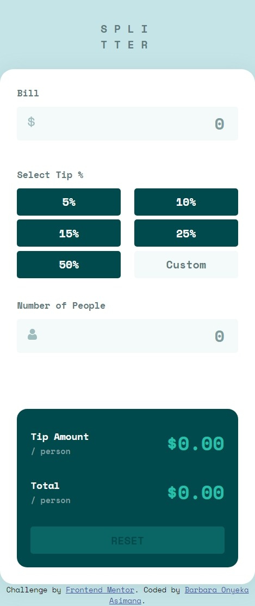
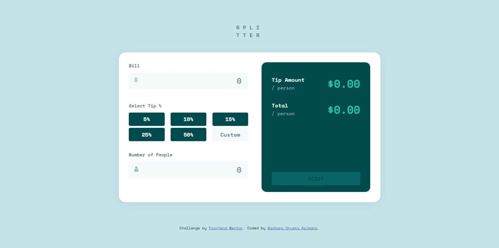

<!-- @format -->

# Frontend Mentor - Tip calculator app solution

This is a solution to the [Tip calculator app challenge on Frontend Mentor](https://www.frontendmentor.io/challenges/tip-calculator-app-ugJNGbJUX). Frontend Mentor challenges help you improve your coding skills by building realistic projects.

## Table of contents

- [Overview](#overview)
  - [The challenge](#the-challenge)
  - [Screenshot](#screenshot)
  - [Links](#links)
- [My process](#my-process)
  - [Built with](#built-with)
  - [What I learned](#what-i-learned)
  - [Continued development](#continued-development)
  - [Useful resources](#useful-resources)
- [Author](#author)

## Overview

### The challenge

Users should be able to:

- View the optimal layout for the app depending on their device's screen size
- See hover states for all interactive elements on the page
- Calculate the correct tip and total cost of the bill per person

### Screenshot

---

DEsktop Screenshot

### Links

- Solution URL: [Add solution URL here](https://your-solution-url.com)
- Live Site URL: [Add live site URL here](https://your-live-site-url.com)

## My process

### Built with

- Semantic HTML5 markup
- Flexbox
- jQuery
- [SCSS](https://styled-components.com/) - For styles

### What I learned

I learned how to make use of SCSS which enabled create reusable styles across this tip calculator.

### Continued development

I'll be focusing on how to use vanilla JS, SCSS and then learning React.js

### Useful resources

- [Resource 1](https://chat.openai.com/)
- [Resource 2](https://www.w3schools.com/)

## Author

- Behance - [asimana Barbara](https://www.behance.net/barbaraasimana)
- Frontend Mentor - [@Barbara131](https://www.frontendmentor.io/profile/yourusername)
- Twitter - [@asimana_barbara](https://x.com/asimana_barbara?t=GnfokJobp2fos4gJwct7eg&s=08)
